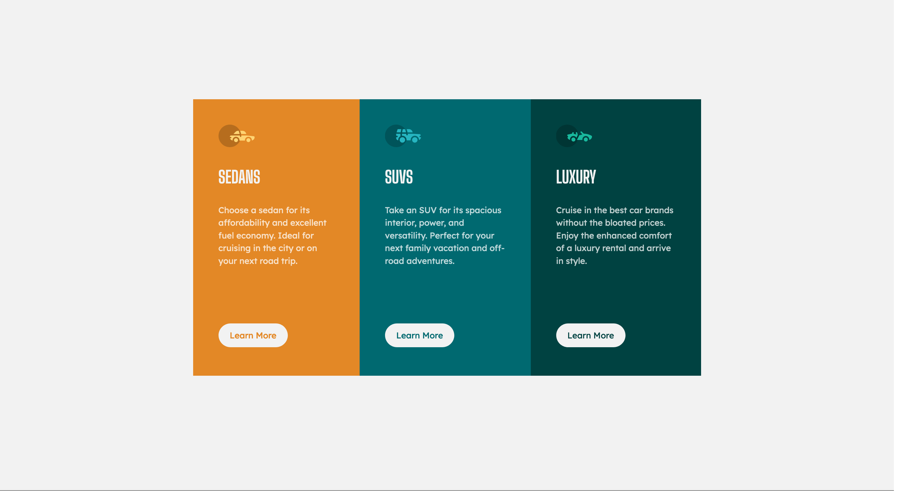

# 3-column preview card component solution

This is a solution to the [3-column preview card component challenge on Frontend Mentor](https://www.frontendmentor.io/challenges/3column-preview-card-component-pH92eAR2-). Frontend Mentor challenges help you improve your coding skills by building realistic projects.

### Screenshot

### Built with

- Semantic HTML5 markup
- CSS
- Flexbox
- Media queries

### What I learned 

### Acknowledgments
